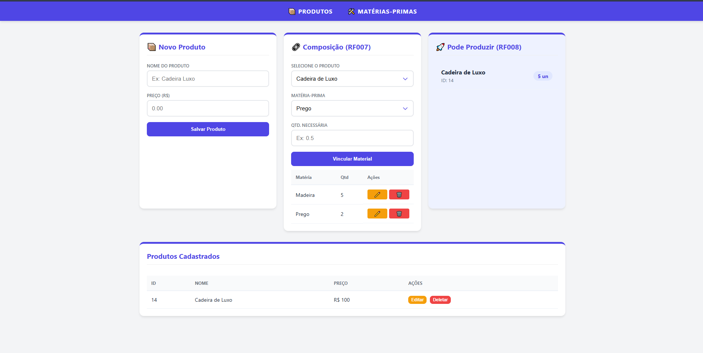
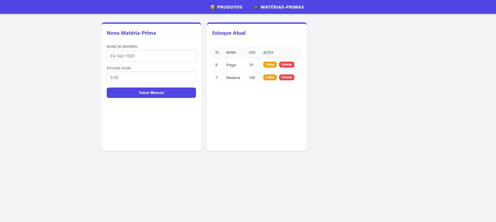
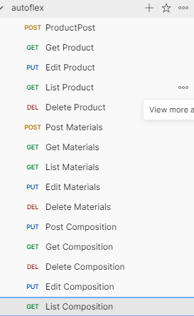

AutoFlex - Gestão de Produção Industrial

Este projeto foi desenvolvido como teste técnico.

O AutoFlex é um sistema de gestão para indústrias que precisam controlar produtos, matérias-primas e calcular automaticamente a viabilidade de produção com base no estoque disponível.

Tecnologias Utilizadas:

Back-end & Database:

Java 21

Spring Boot

Spring Data JPA / Hibernate

PostgreSQL

Lombok

Jakarta Validation

Frontend:

HTML5

CSS3

JavaScript (Vanilla)

Arquitetura e Modelagem

 Composição de Produtos (N:N com atributo):

Foi utilizada uma tabela associativa product_compositions para permitir o atributo:

quantity_needed → quantidade necessária de cada insumo por produto

Regras Implementadas:

Chave primária composta: (product_id, raw_material_id)

ON DELETE CASCADE para produtos

ON DELETE RESTRICT para matérias-primas

Performance:

Índices criados para otimização:

idx_products_price (price DESC)

idx_raw_materials_name

idx_composition_product

Endpoints Principais:

Produtos — /products

POST /products

GET /products/{id}

GET /products/list

PUT /products/{id}

DELETE /products/{id}

Matérias-Primas — /materials

POST /materials

GET /materials/{id}

GET /materials/list

PUT /materials/{id}

DELETE /materials/{id}

Composição — /composition

POST /composition

GET /composition/{id}

GET /composition/list?productId={id}

PUT /composition/{id}

DELETE /composition/{id}

GET /composition/available → Calcula produção possível (RF008)

▶️ Como Executar
1️⃣ Configure o PostgreSQL no application.properties
spring.datasource.url=jdbc:postgresql://localhost:5432/autoflex
spring.datasource.username=postgres
spring.datasource.password=senha
spring.jpa.hibernate.ddl-auto=update
2️⃣ Rode o backend
./mvnw spring-boot:run
3️⃣ Abra o index.html no navegador

📸 Interface do Sistema
🛍️ Tela de Produtos e Composição

🏭 Tela de Matérias-Primas

🧪 Testes da API (Postman)

